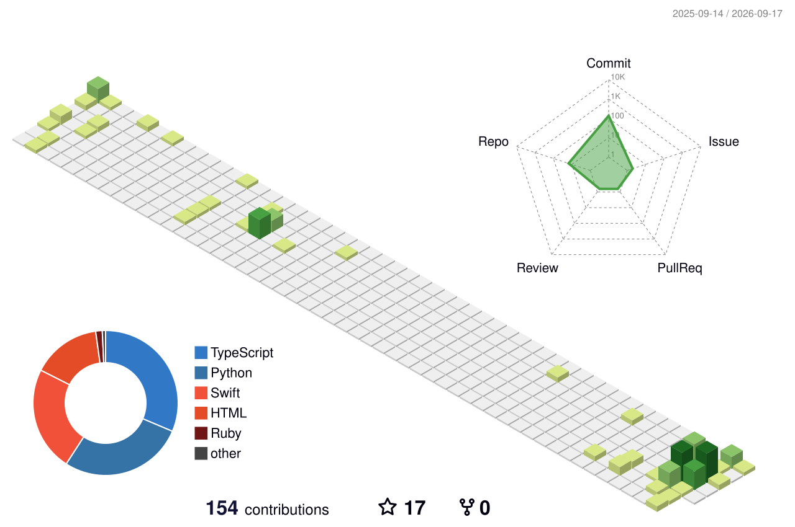

<!-- Typing SVG -->

 

---

### 👋 About Me

- 🎓 Master @ **Zhejiang University (ZJU)**, focusing on AI and frontier computing
- 🤖 Research interests: **Large Language Models (LLM)**, **Agents**, **Medical AI**, **LoRA fine-tuning**
- ✍️ Blog: [Beny's magic house](https://tobychain.github.io) — notes on AI, Agents, and frontier tech
- 📫 Contact: [benygt7@gmail.com](mailto:benygt7@gmail.com)

---

### 🔥 Featured Projects

<table>
<tr>
<td width="50%">

<h3 align="center"><a href="https://github.com/TobyChain/TCMSDaT">TCMSDaT</a></h3>

<strong>⭐ 4 · Python · LLM-based</strong>

LLM-based project — the most starred repo.

</td>
<td width="50%">

<h3 align="center"><a href="https://github.com/TobyChain/TobyChain.github.io">Beny's magic house</a></h3>

<strong>HTML · Tech Blog</strong>

Personal tech blog — notes on AI, Agents, and frontier computing.

</td>
</tr>
</table>

---

### ✍️ Writing

#### Latest Blog Posts

<!-- BLOG-POST-LIST:START -->- **[从0.5到1：如何在AI时代快速搭建自己的LLM理解](https://tobychain.github.io/posts/from-05-to-1-llm-sharing/)** · 2026-07-10<!-- BLOG-POST-LIST:END -->

#### Featured Article

- **[从0.5到1：如何在AI时代快速搭建自己的LLM理解](https://tobychain.github.io/posts/from-05-to-1-llm-sharing/)** · 2026-07-10
  - 本文围绕三个问题展开：LLM 从哪来、当下的大模型长什么样、以及普通学习者如何建立一套持续更新的 AI 学习工作流。
  - [Read on Blog](https://tobychain.github.io/posts/from-05-to-1-llm-sharing/) · [Datawhale WeChat](https://mp.weixin.qq.com/s/HW4tlQfqXvlsDb8PDNd_aA)

#### Publications

📋 [Google Scholar Profile](https://scholar.google.com/citations?user=QFG-e9wAAAAJ&hl=en)

- **[A clinician aligned vision language framework for stepwise interpretation in fundus fluorescein angiography](https://scholar.google.com/citations?view_op=view_citation&hl=en&user=QFG-e9wAAAAJ&citation_for_view=QFG-e9wAAAAJ:u5HHmVD_uO8C)** · *npj Digital Medicine · 2026*
- **[LLM-SDaT: A knowledge-informed LLM framework for syndrome differentiation in TCM](https://scholar.google.com/citations?view_op=view_citation&hl=en&user=QFG-e9wAAAAJ&citation_for_view=QFG-e9wAAAAJ:d1gkVwhDpl0C)** · *Neural Networks · 2026*
- **[OBUSight: Clinically Aligned Generative AI for Ophthalmic Ultrasound Interpretation and Diagnosis](https://scholar.google.com/citations?view_op=view_citation&hl=en&user=QFG-e9wAAAAJ&citation_for_view=QFG-e9wAAAAJ:u-x6o8ySG0sC)** · *Advanced Science · 2026*

---

### 📊 Contribution Graph

---

### ⭐ Recently Starred Repos

---

### 💬 Dev Quote

---

Built with ❤️ · Last updated: 2026-07-20

